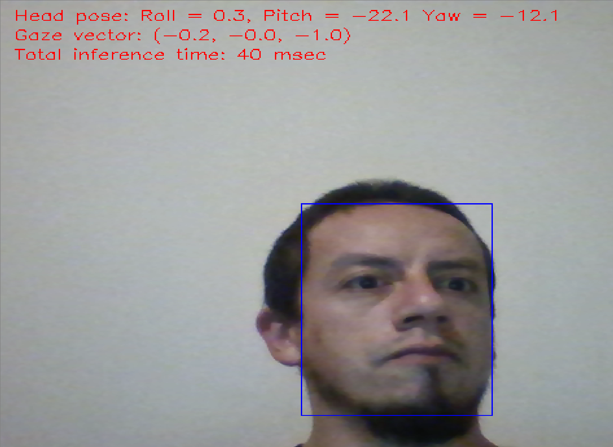

# Computer Pointer Controller

This is an AI computer pointer controller written in Python, it allows you to move your mouse pointer using your gaze, it uses Intel's OpenVino Toolkit to perform inference on video feed from a webcam, however, running it is also possible using pre recorded video


*WARNING*: notice that OpenVino uses OpenCV to process video feed, so, not all video formats might be compatible with your system, and this varies between different OSs (Windows, for example, only supports .AVI videos)





## Project Set Up and Installation


### 1 - Install OpenVino Toolkit

Follow the instructions for your OS here:

* [Linux](https://docs.openvinotoolkit.org/latest/_docs_install_guides_installing_openvino_linux.html)
* [Windows](https://docs.openvinotoolkit.org/latest/_docs_install_guides_installing_openvino_windows.html)
* [MacOS](https://docs.openvinotoolkit.org/latest/_docs_install_guides_installing_openvino_macos.html)


### 2 - Download models

This app requires 4 pretrained models to run, you can find the models' docs here:

* [Face Detection model](https://docs.openvinotoolkit.org/latest/_models_intel_face_detection_adas_binary_0001_description_face_detection_adas_binary_0001.html)
* [Head Pose Estimation model](https://docs.openvinotoolkit.org/latest/_models_intel_head_pose_estimation_adas_0001_description_head_pose_estimation_adas_0001.html)
* [Facial Landmarks Detection model](https://docs.openvinotoolkit.org/latest/_models_intel_landmarks_regression_retail_0009_description_landmarks_regression_retail_0009.html)
* [Gaze Estimation model](https://docs.openvinotoolkit.org/latest/_models_intel_gaze_estimation_adas_0002_description_gaze_estimation_adas_0002.html)

You can use OpenVino's [Model Downloader](https://docs.openvinotoolkit.org/latest/_tools_downloader_README.html) to get these models, as they are all part of [Intel's Open Model Zoo](https://docs.openvinotoolkit.org/latest/_models_intel_index.html)


### 3 - Clone or download source code

This repo contains all source code required to run this application, I suggest that you create a folder to contain all required files and either clone this repo in it or download the source files as a ZIP and extract them there, you might want to move all previously downloaded models to your source folder to avoid typing long paths later on


### 4 - If not already installed, install Python 3

To run this application, your system needs Python3 installed and added to your PATH, see instructions [here](https://www.tutorialspoint.com/python/python_environment.htm)


### 5 - Install all dependencies

Inside your source folder you will find a requirements.txt file that contains a list of all modules required to run the application, to install the required modules, open a terminal/command prompt, navigate to the folder that contains all the source files you cloned earlier and run:

`pip install -r requirements.txt`

*NOTE*: If you are, or plan to be working on other python projects on your system, creating a virtual environment for this one is highly recommended, if you don't know how to do this check a quick tutorial [here](https://realpython.com/python-virtual-environments-a-primer/), do this before you install this project's dependencies to avoid reinstalling other versions of modules that might already be installed on your system


## Running the application


### 0 - System requirements

To be able to run the application as indicated below, you will need:

* Intel CPU (6th GEN or newer, Core o Atom series - tested on 9th GEN core I5 CPU)
* A camera, webcam will do just fine


### 1- Setup the environment

You must configure the environment to be able to run inference using the OpenVino Toolkit, this must be done for each session, to do this open a terminal/command prompt, navigate to your source folder and run:


| OS            | Command                                                      |
| ------------- | ------------------------------------------------------------ |
| Windows       | `C:\"Program Files (x86)"\IntelSWTools\Openvino\bin\setupvars.bat` |
| Linux / MacOS | `source /opt/intel/openvino/bin/setupvars.sh`                |


*NOTE* This assumes you have installed OpenVino to the default directory, if not, change accordingly


### 2 - Setup a configuration file

To avoid having to type very long command line arguments each time you run the application, this project uses the [ConfigArgParse](https://pypi.org/project/ConfigArgParse/) module, which allows the application to use a configuration file where you can list all arguments needed (see the [command line arguments](#command-line-arguments) section for a complete description of available arguments)


A configuration file template (config_template.conf) is included with the source code,  it's written using INI syntax (Note that sections are ignored/treated as comments), you need to insert the paths to all your downloaded models as follows:


```ini
#Configuration file for PointerController APP

[MODEL PATHS]

face_detection_model = ./models/face-detection-adas-binary-0001/FP32-INT1/face-detection-adas-binary-0001.xml
head_pose_model = ./models/head-pose-estimation-adas-0001/FP16/head-pose-estimation-adas-0001.xml
facial_landmarks_model = ./models/landmarks-regression-retail-0009/FP16/landmarks-regression-retail-0009.xml
gaze_estimation_model = ./models/gaze-estimation-adas-0002/FP16/gaze-estimation-adas-0002.xml

[INPUT]

#Use cam, video or image
input_type = cam
#If cam input_type is used input_path will be ignored
input_path = ./bin/demo.mp4
```


The above configuration assumes you have placed all your models on a "models" folder, and your test videos on a "bin" folder, notice that if you select cam as the input type, whatever path you provide for the video will be ignored by the application


### 3 - Run the PointerController.py module

To run the application, you'll need to provide, as a minimum, one command line argument -c, with the path to your configuration file, open a terminal/command prompt, navigate to your source folder and run:


`python PointerController.py -c config_template.conf`


If everything was done correctly, you should see a white screen like this one:


If you have followed along, you should be able to control the mouse pointer with your gaze now, the results won't probably be accurate though, as the application was calibrated on my laptop, and you are using my calibration file (calibration.npz), the application can be calibrated to your screen and camera though (see [App Calibration](#app-calibration) below)

As you can see on screen, the application can be terminated either by pressing 'q' on the keyboard or moving the mouse pointer (using your actual mouse/trackpad) to any corner of the screen


## Documentation


### Command line arguments

This project supports the following command line arguments:

| Argument                 | Description                                                  | Required | Default |
| ------------------------ | ------------------------------------------------------------ | :------: | :-----: |
| -c / --config_file       | Path to configuration file                                   |   YES    |   N/A   |
| -t / --input_type        | Type of input, can choose between cam, video and image*      |    NO    |   cam   |
| -p / --input_path        | Path to input video file, ignored if using cam as input type |    NO    |   N/A   |
| --face_detection_model   | Path to face detection model xml                             |   YES    |   N/A   |
| --head_pose_model        | Path to head pose estimation model xml                       |   YES    |   N/A   |
| --facial_landmarks_model | Path to facial landmarks detection model xml                 |   YES    |   N/A   |
| --gaze_estimation_model  | Path to gaze estimation model xml                            |   YES    |   N/A   |
| -d / --device            | Device to run inference on**                                 |    NO    |   CPU   |
| --calibrate              | Run camera/screen calibration                                |    NO    |  False  |
| --display_all            | Show video feed with inference results from each model       |    NO    |  False  |

**image mode has not been implemented yet*

***you can specify the device, however, as tested, the application will only run on CPU as there are layers in the models not supported by other hardware choices, HETERO mode could be used, but it hasn't been tested*


### App Calibration

In order to make the application more accurate, if you're using camera feed input, you can calibrate the application to your particular screen an camera, to do this, run the application using the --calibrate command line argument, if you do, you will see the following screen:


A blue square will appear at each corner of the screen, you need to look at it for a couple seconds, and while looking at it press 'n' on your keyboard, repeat this for every corner and the application will scale the inference output to match your screen and camera, this will give you better control of the pointer

*NOTE*  Calibration is saved in the calibration.npz file which you can find in the source folder


## Benchmarks

This project was tested on an Intel Core I5, 9th GEN CPU, using FP32, FP16 and INT8 precisions for all models, integrated GPU and NCS2 were also tested but there are layers in the models used that are not supported

Benchmark results for the tested model precisions are summarized below:

| Model Precision | Model load time     | Total inference time | Total models size |
| --------------- | ------------------- | -------------------- | ----------------- |
| INT8            | around 0.75 seconds | 11 msec              | around 6.3 MB     |
| FP16            | around 0.6 seconds  | 12 msec              | around 9.6 MB     |
| FP32            | around 0.65 seconds | 12 msec              | around 17.2 MB    |

As shown in the table above, performance metrics are pretty much the same for all precisions tested, with load time slightly higher for INT8 precision, accuracy was not affected by changing the precision, perceived stability of the pointer position was pretty much identical for all tests, therefore, the only motivation to prefer INT8 precision over all other options is lower models size which can be an important factor to consider on a low memory edge device